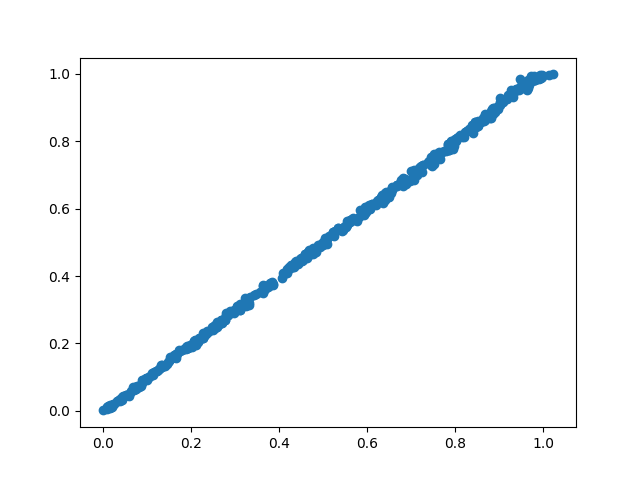
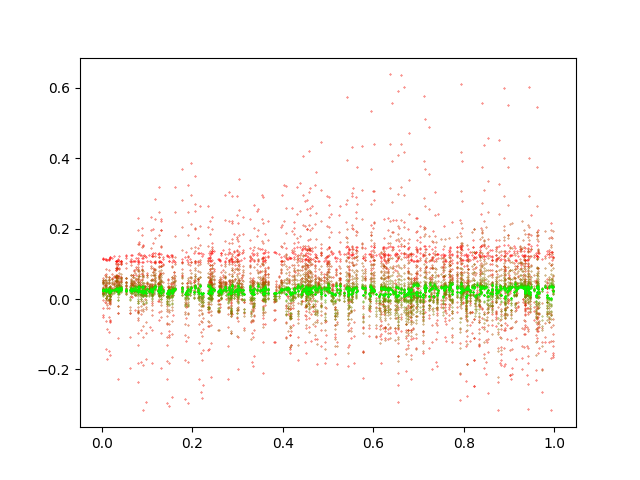

[BYOL: Build Your Own Latent](https://arxiv.org/abs/2006.07733)
[SimSiam](https://arxiv.org/abs/2011.10566)
[noise contrastive estimation](https://www.kdnuggets.com/2019/07/introduction-noise-contrastive-estimation.html)

log:
read over the pytorch code (think i understand it 35%?)
found some links
skimmed https://journals.aps.org/prresearch/pdf/10.1103/PhysRevResearch.2.033499 skipped the physics parts
looked over rumen and peter's slides/notes
got the environment to work, ran pendulum.py (epochs slow -_-)
lagragian????????????

https://ai.facebook.com/blog/self-supervised-learning-the-dark-matter-of-intelligence/

video: audio visual instance discrimination with cross modal agreement (video paper?)

http://www.incompleteideas.net/IncIdeas/BitterLesson.html

https://paperswithcode.com/paper/softmax-splatting-for-video-frame

neural arithmetic logic unit https://arxiv.org/pdf/1808.00508.pdf

machine teaching?

questions:
-why 3 instead of 1 as in [learning conserved quantities using siamese](https://journals.aps.org/prresearch/pdf/10.1103/PhysRevResearch.2.033499 )
-what's a projector

what is temperature

read about cross entropy

supervised version

trajectory length adjustment

any 2 points

noise

supervised works.

(energy vs output)

i think its happening because of collapse

x=energies y=outputs red -> green = through training time

it wasn't really COLLAPSING what was happening was that infonce had
first line which was normalizing and thus all the 1D vectors got mapped to
{1, -1} -_-

made normalizing only do for vectors of length >1

getting nan issues.  setting weight decay to 0.01? (instead of 0.001?) maybe this will help

ok jk we just made it 2d and it works so wonderfully

color = energy

also its linear in terms of angle ? interesting

also it reproduces really well for whatever reason?????

generalization ability?

linear projector?

infonce uses more negative samples than the simclr loss

https://journals.aps.org/prl/abstract/10.1103/PhysRevLett.126.1806043
