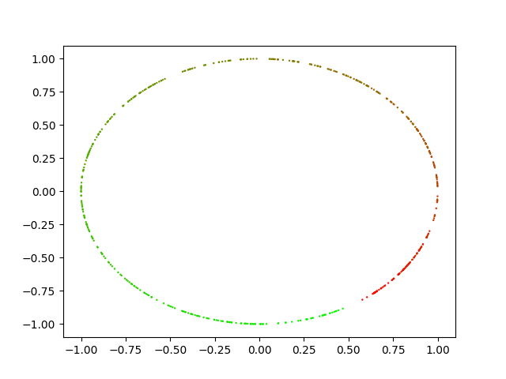
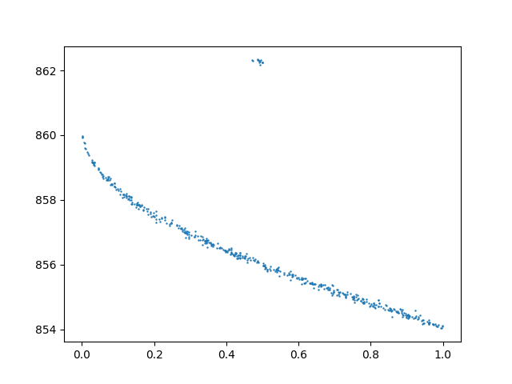
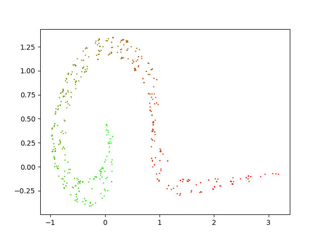
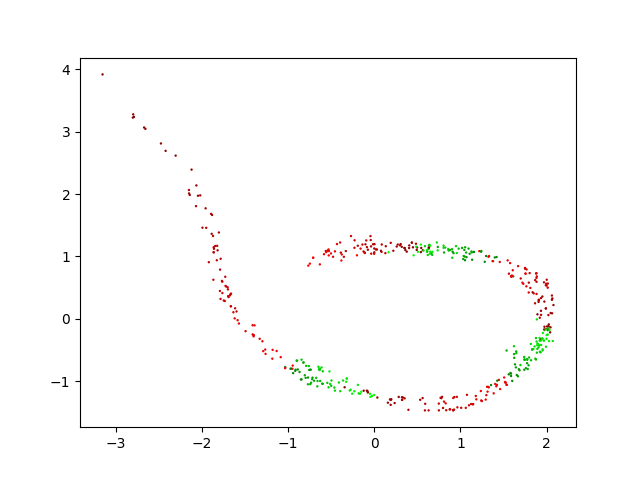
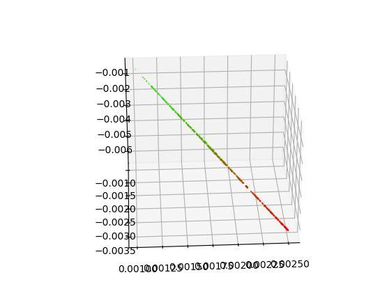

i think sigmoid output after the linear layer is best

implemented two frame version, maybe will try blur later if this doesnt work

or tomorrow

why is gpu same speed as cpu :|

yay supervised works

(on test)

now trying unsupervised!

got gpu to work, it is faster, but god darn who thought it would be funny to
make you type .cuda() everywhere -_-

loss remained at 6.238 for an impressive 290 EPOCHS before going downwards ...

PARAMETERS are conserved quantities

gaps make it sad (takes forever to do better than 6.238)

one that works [0,0.3+0.4,0.7+0.8,1] is faithful:

with normalizing: WORKS A LOT BETTER trains within 10 epochs:

(output normalized as well)

simsiam just collapses :| or produces very useless things (let's try to fix simsiam tomorrow)

information theory x gaps

this is the normal version with angle vs energy:

why the little tail up? maybe bc hard to distinguish at low energy?

how to tell if an embedding is "good"

noise helps a lot with simsiam (still not that good though)

think the issue is that the simple predictor is not distorting the values enough

yay got x11 forwardin gto work: use -Y and start up XQuartz

eucliean works: 

gap compression phenomenon: 

simsiam works for real.  here are parameters:

``python pendulum.py --method=simsiam --euclidean --verbose --noise=0.05 --epochs=250 --lr=0.02 --wd=0.01 --pred_lr=0.1 --clip=1``

i think you need high pred lr and strong clipping/weight decay to fix it

simsiam does better because it actually keeps the dimensionality of the representation (no weird smoke curve things).  even in 3d the representation is very faithful:

it does "collapse" the line segment gets shorter and shorter

fix list 1:

[x] more Noise
[ ] fix variance
[ ] prefer euclidean over cosine
[ ] cropped image view
[ ] partial trails
[ ] scrambled trails
[ ] test set 20x per energy, less pendulums (maybe 100 ? if possible)

send the code for the image generation

infonce without clipping

maximum variance = unfolding?

isomap

extrapolation

manifold learning => 1D then correlation (spearman correlation)

predict energy from embedding (kernel regression)

simple NN for embedding => energy

pca to look at simsiam lines

transfer learn = generalization

simsiam is clustering?

peter/anugrah spectral embedding https://openreview.net/pdf?id=rkmf_v1vf

what is unexpected

fix list 2: unfolding wish list
[ ] maximum variance
[ ] partially deep NN on output
[ ] isomap, + correlation (spearman?)
[ ] kernel regression???
[ ] pca
[ ] spectral embedding

wish list:
[ ] "objective" battery of tests for noise resistance + partial data + interpolation + extrapolation
  [ ] include more than one image creation method
[ ] "objective" criterion for embedding (remember cosine exists too)
[ ] code up all of these:
  [x] infonce
  [ ] simclr
  [x] simsiam
  [ ] byol
  [ ] normie batch norm
  [ ] decorrelated batch norm
  [ ] barlow twins
  (and maybe take a look at that vision transformer paper?)
