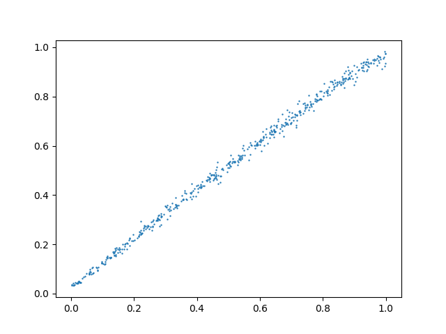

i think sigmoid output after the linear layer is best

implemented two frame version, maybe will try blur later if this doesnt work

or tomorrow

why is gpu same speed as cpu :|

yay supervised works

(on test)

now trying unsupervised!

got gpu to work, it is faster, but god darn who thought it would be funny to
make you type .cuda() everywhere -_-

loss remained at 6.238 for an impressive 290 EPOCHS before going downwards ...
